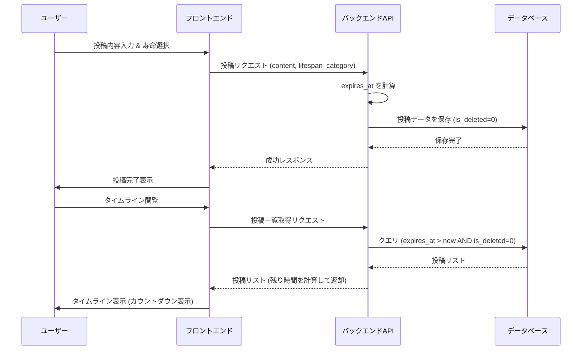
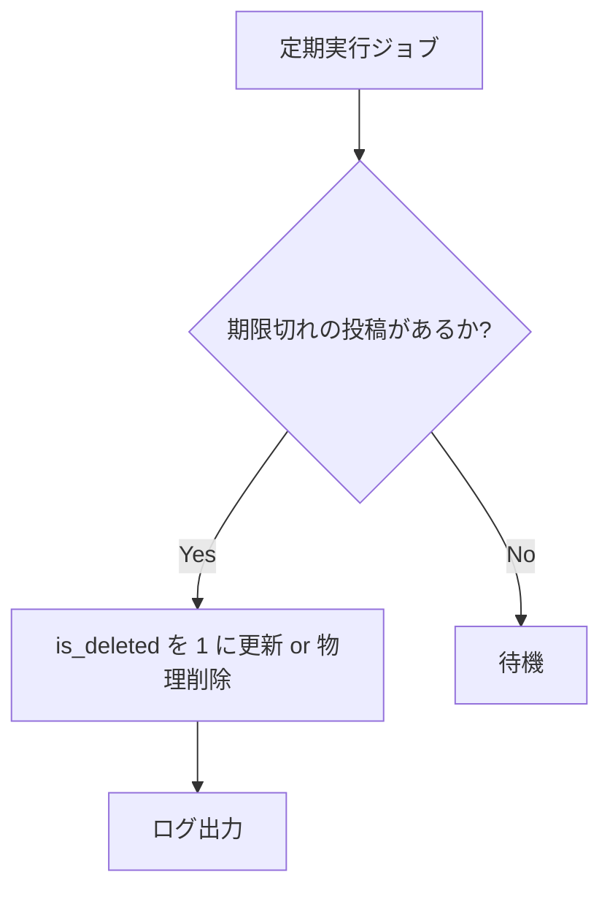

# 業務フロー図

## 1. 投稿から表示までのフロー

```mermaid
sequenceDiagram
    participant User as ユーザー
    participant Front as フロントエンド
    participant API as バックエンドAPI
    participant DB as データベース

    User->>Front: 投稿内容入力 & 寿命選択
    Front->>API: 投稿リクエスト (content, lifespan_category)
    API->>API: expires_at を計算
    API->>DB: 投稿データを保存 (is_deleted=0)
    DB-->>API: 保存完了
    API-->>Front: 成功レスポンス
    Front->>User: 投稿完了表示

    User->>Front: タイムライン閲覧
    Front->>API: 投稿一覧取得リクエスト
    API->>DB: クエリ (expires_at > now AND is_deleted=0)
    DB-->>API: 投稿リスト
    API-->>Front: 投稿リスト (残り時間を計算して返却)
    Front->>User: タイムライン表示 (カウントダウン表示)
```

## 2. 自動削除フロー（バックグラウンド）

```mermaid
graph TD
    A[定期実行ジョブ] --> B{期限切れの投稿があるか?}
    B -- Yes --> C[is_deleted を 1 に更新 or 物理削除]
    C --> D[ログ出力]
    B -- No --> E[待機]
```
