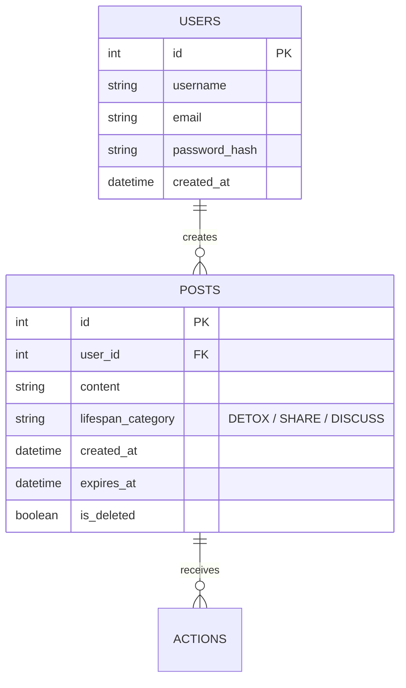

# データベース設計

## 1. ER図（簡易）

## 2. テーブル定義

### Users (ユーザー)
| カラム名 | 型 | 制約 | 備考 |
| :--- | :--- | :--- | :--- |
| id | int | PK, Identity | ユーザーID |
| username | nvarchar(50) | Not Null, Unique | ユーザー名 |
| email | nvarchar(255) | Not Null, Unique | メールアドレス |
| password_hash | nvarchar(max) | Not Null | ハッシュ化されたパスワード |
| created_at | datetime | Not Null, Default(GETDATE()) | アカウント作成日時 |

### Posts (投稿)
| カラム名 | 型 | 制約 | 備考 |
| :--- | :--- | :--- | :--- |
| id | int | PK, Identity | 投稿ID |
| user_id | int | FK(Users.id), Not Null | 投稿者ID |
| content | nvarchar(280) | Not Null | 投稿本文 |
| lifespan_category | nvarchar(20) | Not Null | カテゴリー名 |
| created_at | datetime | Not Null, Default(GETDATE()) | 投稿日時 |
| expires_at | datetime | Not Null | 自動削除（期限）日時 |
| is_deleted | bit | Not Null, Default(0) | 論理削除フラグ（オプション） |

## 3. インデックス設計
- `POSTS.expires_at`: 削除期限が過ぎた投稿を効率的に抽出・フィルタリングするために、非クラスター化インデックスを作成。
