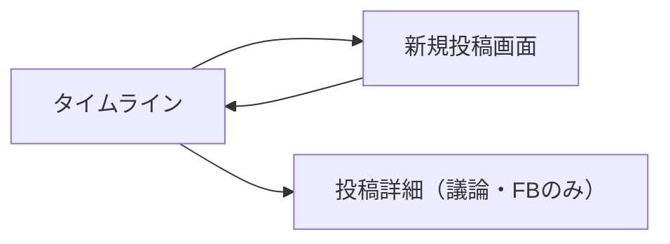

# ワイヤーフレーム

## 1. 画面遷移図

## 2. タイムライン画面 (Timeline)
情報の鮮度と「寿命」を視覚的に強調するデザイン。

### コンポーネント構成
- **ヘッダー:** アプリ名、新規投稿ボタン
- **投稿カード:**
    - **ユーザーアイコン・名**
    - **投稿内容:** テキスト、画像（任意）
    - **残り時間バッジ:** 
        - 例：「残り 12分」（赤色系：急ぎ）
        - 例：「残り 23時間」（黄色系：日常）
        - 例：「残り 2日」（青色系：議論）
    - **アクション:** いいね（限定的）、コメント（議論・FBのみ）

---

## 3. 新規投稿画面 (Create Post)
寿命を選択することにフォーカスしたUI。

### コンポーネント構成
- **テキストエリア:** 投稿内容を入力（最大280文字など）
- **寿命選択（タブまたはセグメントコントロール）:**
    - **デトックス:** [15分] [30分] [60分]
    - **共有:** [24時間]
    - **議論:** [48時間] [72時間]
- **投稿ボタン:** 選択した寿命を確認して投稿

---

## 4. デザインの方向性
- **フォント:** 読みやすさを重視しつつ、モダンなサンセリフ体（Inter等）。
- **アニメーション:** 投稿が消える際に、ふわっと消えるようなエフェクトを検討。
- **ダークモード:** 深夜の「デトックス」利用を考慮し、目に優しいダークモードを推奨。
